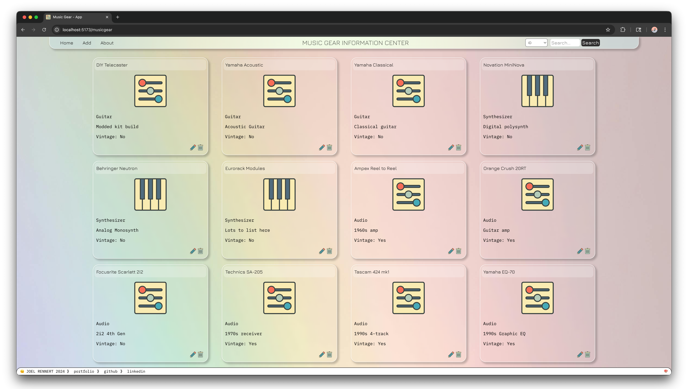

# musicgear
Basic Personal Music Gear Information Center

A simple RESTful web app to manage personal music gear.

Built with Java, Spring Boot, PostgreSQL, and Vue.js.
Supports full CRUD operations for tracking owned gear.

